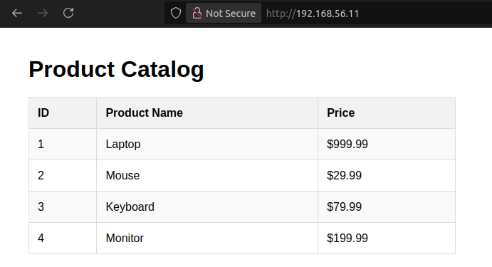

# Individual-2: Linux

Вирішив зробити завдання трохи цікавішим: створив три віртуалки з Ubuntu (Веб-сервер з nginx та PHP, База даних MySQL, Бастион), помістив їх на одну локальну мережу (`192.168.56.0/24`) та під'єднав веб-сервер до бази даних завдяки SSH tunneling через бастион.

Веб-сервер робить local port forwarding (`3306`) до бастиону, який в свою чергу напряму зв'язується з БД. На веб-сервері стоїть простенький PHP бекенд, який робить запит до БД через SSH тунель, та відображає усі результати у вигляді таблиці на HTML сторінці якщо перейти по `http://192.168.56.11:80`. На базі даних налаштував iptables, щоб доступ до порту 3306 був лише з бастиону.



Також створив [bash скрипт](./scripts/system-monitor.sh), який збирає дані про використання CPU + RAM та зберігає їх у `/var/log/system_monitor.log`. Щоб запускати цей скрипт кожну годину в робочі дні, створив для цього crontab наступним чином:
```bash
echo "0 * * * 1-5 root /vagrant/scripts/system-monitor.sh" > /etc/cron.d/system-monitor
```

Перед тим, як почав реалізовувати задачу, стало цікаво, чи є щось схоже на Terraform але для VM. Так дізнався про Vagrant і вирішив використати його, щоб описати усі віртуалки у вигляді коду. Якщо у вас встановлений VirtualBox та Vagrant, можливо запустити всю інфраструктуру у себе:
```bash
git clone https://github.com/LetMeCookPlz/DevOps-Internship
cd DevOps-Internship/Individual-2-Linux/
mkdir scripts/ssh-keys/
ssh-keygen -t rsa -b 4096 -f scripts/ssh-keys/bastion-key -N ""
ssh-keygen -t rsa -b 4096 -f scripts/ssh-keys/db-key -N ""
ssh-keygen -t rsa -b 4096 -f scripts/ssh-keys/web-key -N ""
vagrant up
```

Потім можливо під'єднатися по SSH до будь якої віртуалки наступними командами:
```bash
ssh -i scripts/ssh-keys/bastion-key bastion@192.168.56.12 # Бастион
ssh -i scripts/ssh-keys/bastion-key -t bastion@192.168.56.12 "ssh -t root@database" # База даних
ssh -i scripts/ssh-keys/bastion-key -t bastion@192.168.56.12 "ssh -t root@webserver" # Веб-сервер
```

*P.S. Використав ланцюг SSH команд через флаг -t замість -J (бастион як jump host), щоб ключі до БД та веб-серверу шукались на бастионі, а не на клієнті.*