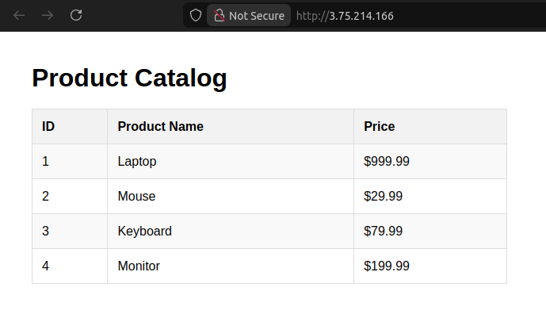
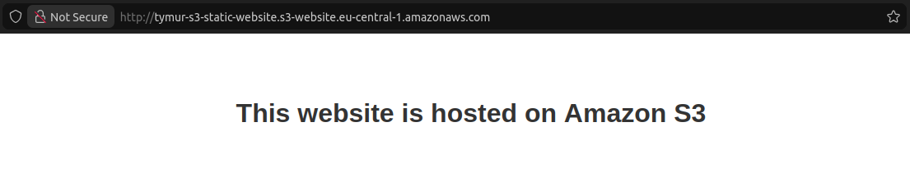
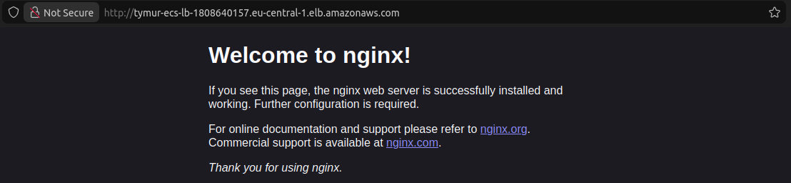
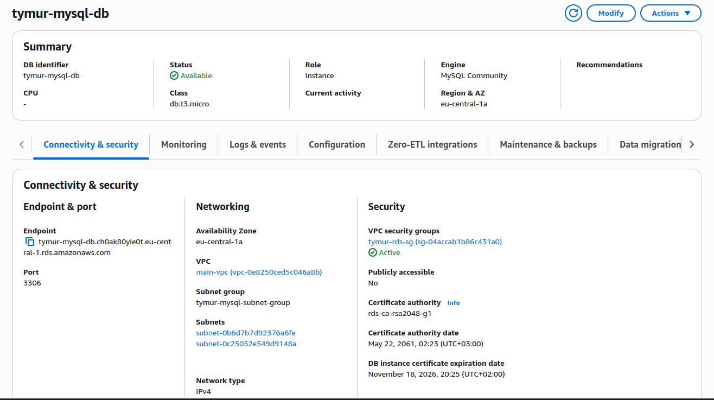
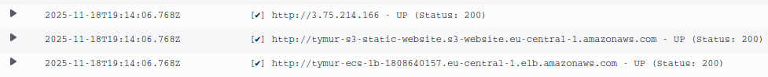
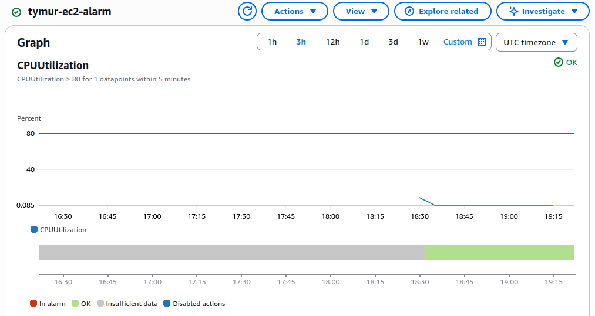
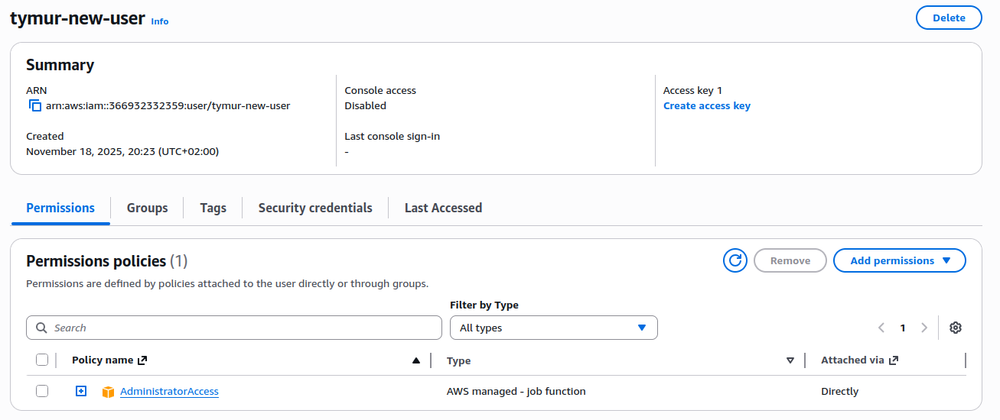

# Individual-3: AWS

### EC2 з Nginx та PHP
Знаходиться у публічній мережі. При створенні ініціалізує таблицю у RDS, що знаходиться у првиватній мережі. Пілся цього PHP конектиться до RDS та відображає вміст таблиці на веб-сторінці, яка доступна через Nginx.

### S3 Static Website

### ECS з Nginx
Доступний через Load Balancer, який знаходиться у публічній мережі. Образ Nginx підтягує з власного ECR репозиторію. 

### MySQL RDS
Знаходиться у приватній мережі та доступний лише для EC2. Кожний тиждень виконується автоматичний бекап. Використав MySQL замість PostgreSQL, так як краще інтегрується з PHP на EC2. 

### Lambda Healthcheck Function
Кожні 5 хвилин автоматично перевіряє, чи доступні створені вебсайти на EC2, S3 та ECS. 

### CloudWatch Alarm (EC2 CPU > 80%)

### IAM (Новий Користувач)

### Terraform
Всі ресурси (окрім ECR) були створені через Terraform, код доступний у цьому репозиторії.